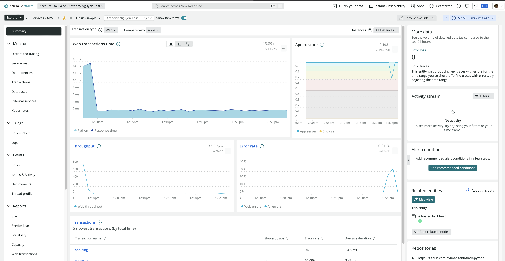
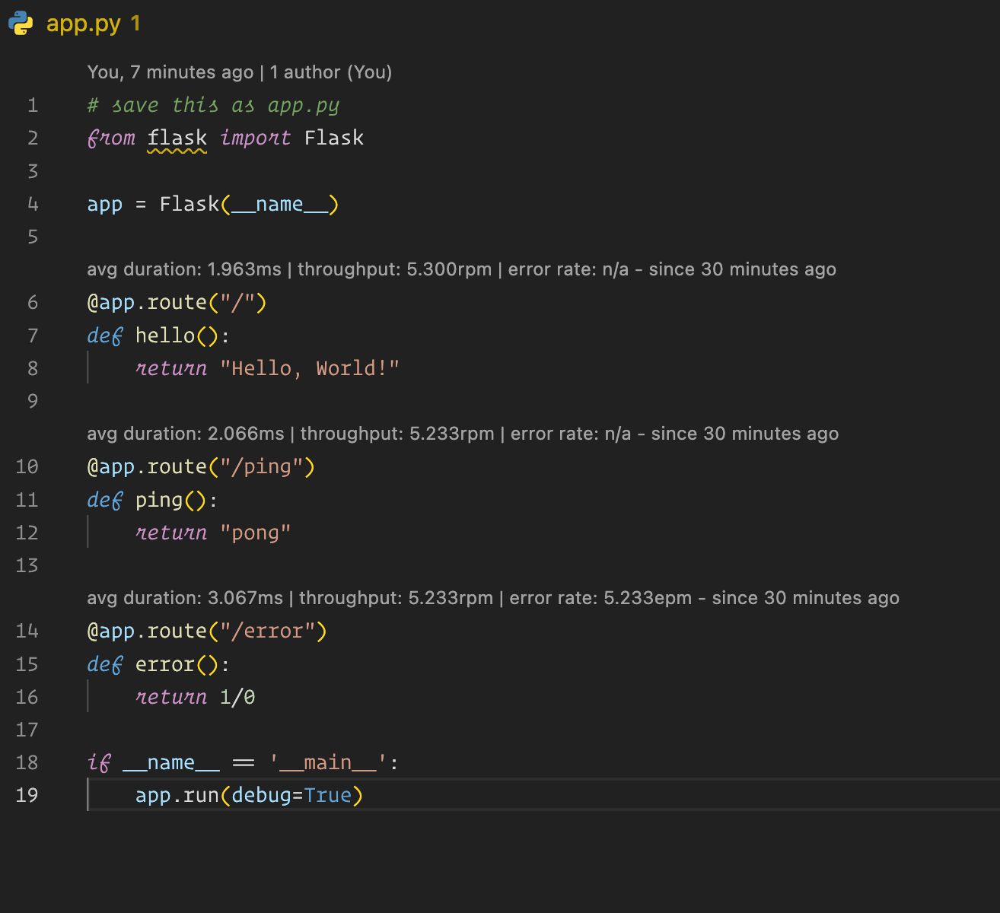
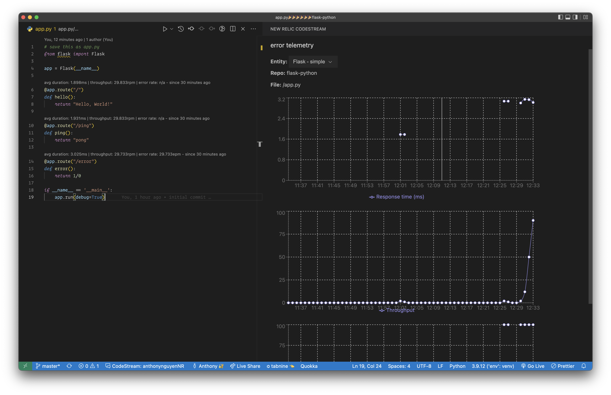
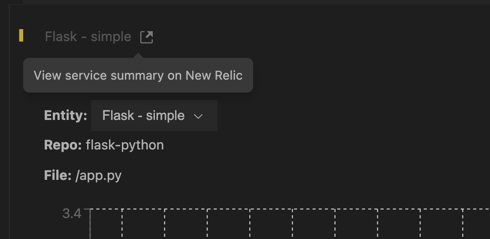

# See Code Level Metrics inside you IDE with CodeStream and NewRelic

## Step 1: deploy a plain Flask app to k8s

```bash
# deploy to your k8s cluster
kubectl apply -f k8s.yaml -n sock-shop

# get public IP address of the service
kubectl get service --watch --namespace=sock-shop

# make sure you connect to it
curl http://<YOURPUBLICIP>/error

# install https://github.com/rakyll/hey
brew install hey

# load test the Flask API
hey -n 2000 http://<YOURPUBLICIP>/ping
```

## Step 2: Add newrelic apm Agent

```bash
# update the image of the deployment and use the image with APM Agent installed
kubectl set image deployment/flask-simple \
    flask-simple=anthonynguyen334/flask-codestream:withNRApm \
    -n sock-shop

# get your ingest license at one.newrelic.com
# mac/ linux
YOUR_NR_INGEST_API=<Ingest Key>

# windows
set YOUR_NR_INGEST_API=<Ingest Key>


# Set required env variables
kubectl set env deployment/flask-simple \
    NEW_RELIC_LICENSE_KEY=$YOUR_NR_INGEST_API \
    NEW_RELIC_APP_NAME="Flask - simple" \
    NEW_RELIC_NO_CONFIG_FILE=true \
    NEW_RELIC_DISTRIBUTED_TRACING_ENABLED=true \
    NEW_RELIC_METADATA_REPOSITORY_URL=https://github.com/nvhoanganh/flask-python.git \
    NEW_RELIC_METADATA_COMMIT=b2323343c12ae61ce3624ae80253f3483434780b \
    --namespace=sock-shop

# restart the deployment
kubectl rollout restart deployment flask-simple -n sock-shop

# browse http://<YOURPUBLICIP>/ or http://<YOURPUBLICIP>/ping or http://<YOURPUBLICIP>/error
# go to NR One, you should see your app under APM
```



## Step 3: Connect CodeStream and view Code Level Metrics

```bash
# install latest version of Codestream extension for VSCode and connect to NR One using User key
# reload Vscode and open this repository
# make sure you install the python extension for VSCode

# install k6 (https://k6.io/docs/getting-started/installation/)
brew install k6

# in VSCode , open app.py file, then in the background, run the load tests
k6 run -e PUBLIC_IP=<YOURPUBLICIP> loadtest.js
```

-   you should see this after a minute or two
    
-   click on the Telemetry on top of each method, will show this
    
-   you can click on this link to jump directly to the APM service
    

## Option: deploy to AWS ECS Fargate

-   run

```bash
## download installer

curl -O https://download.newrelic.com/infrastructure_agent/integrations/ecs/newrelic-infra-ecs-installer.sh
./newrelic-infra-ecs-installer.sh -f -c YOUR_CLUSTER_NAME -l YOUR_LICENSE_KEY

# give execute permission
chmod +x newrelic-infra-ecs-installer.sh

# make sure you have aws cli installed and check version
aws configure get region

# list the cluster, note the cluster you want to deploy
$ aws ecs list-clusters

# give execute permission
./newrelic-infra-ecs-installer.sh -f -c YOUR_CLUSTER_NAME -l YOUR_LICENSE_KEY
```
