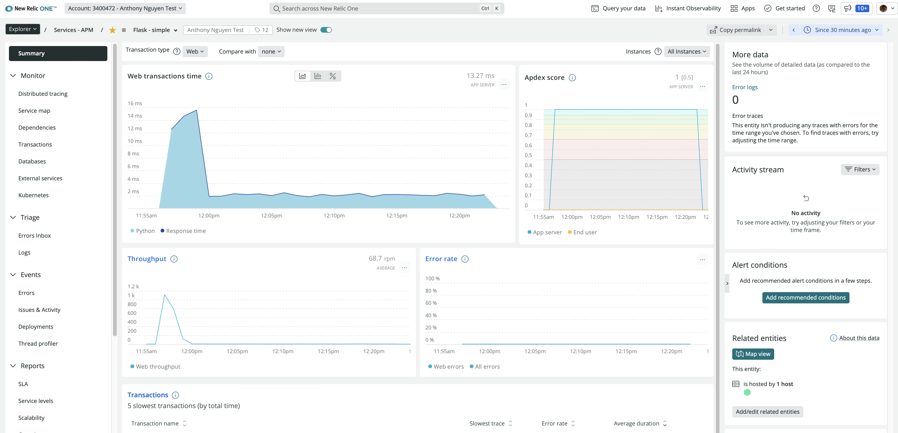

# See Code Level Metrics inside you IDE with CodeStream and NewRelic

## Step 1: deploy a plain Flask app to k8s

```bash
# build the docker image
docker buildx build . --platform linux/amd64 -t anthonynguyen334/flask-codestream --progress=plain

# push the docker image
docker tag anthonynguyen334/flask-codestream anthonynguyen334/flask-codestream:latest
docker push anthonynguyen334/flask-codestream:latest

# deploy to your k8s cluster
kubectl apply -f k8s.yaml -n sock-shop

# get public IP address of the service
kubectl get service --watch --namespace=sock-shop

# make sure you connect to it
curl http://<YOURPUBLICIP>/error

# install https://github.com/rakyll/hey
brew install hey

# load test the Flask API
hey -n 2000 http://20.121.251.151/ping
```

## Step 2: Add newrelic apm Agent
```bash
# build newrelic base image
docker buildx build -f NewRelicBaseImageDockerFile . --platform linux/amd64 -t python_newrelic:latest --progress=plain

# update Dockerfile and replace 'FROM python:3.8-slim-buster' to 'FROM python_newrelic:latest' and build image again
docker buildx build . --platform linux/amd64 -t anthonynguyen334/flask-codestream:withNRApm --progress=plain
# push the updated image
docker push anthonynguyen334/flask-codestream:withNRApm

# update the image of the deployment
kubectl set image deployment/flask-simple \
    flask-simple=anthonynguyen334/flask-codestream:withNRApm \
    -n sock-shop

# Set required env variables
kubectl set env deployment/flask-simple \
    NEW_RELIC_LICENSE_KEY=df31781c18d67c8ce976afbc264ab666FFFFNRAL \
    NEW_RELIC_APP_NAME="Flask - simple" \
    NEW_RELIC_NO_CONFIG_FILE=true \
    NEW_RELIC_DISTRIBUTED_TRACING_ENABLED=true \
    NEW_RELIC_METADATA_REPOSITORY_URL=https://github.com/nvhoanganh/flask-python.git \
    NEW_RELIC_METADATA_COMMIT=cb3394af076879d31f49ab8da14b55c56c9329cc \
    --namespace=sock-shop

# browse http://20.121.251.151/ or http://20.121.251.151/ping or http://20.121.251.151/error
# go to NR One, you should see your app under APM
```



## Step 3: Connect CodeStream and view Code Level Metrics

```bash
# install latest version of Codestream extension for VSCode and connect to NR One using User key
# reload Vscode and open this repository

# install k6 (https://k6.io/docs/getting-started/installation/)
brew install k6

# Run the load tests
k6 run -e PUBLIC_IP=20.121.251.151 loadtest.js
```
